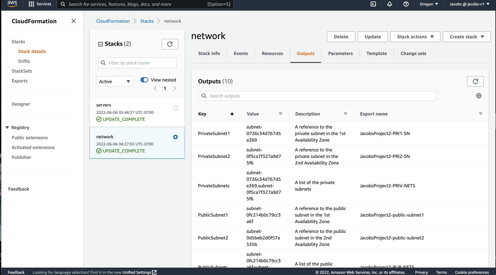

## Deploy a Highly-Available Web App using CloudFormation

### [Live Link](http://serve-webap-45mrl2yhsgab-1411785819.us-west-2.elb.amazonaws.com/)

### Architecture Diagram

### Files 

* network.yml & network-parameters.json ====> Creates/updates the network Stack
* servers.yml & server-parameters.json =====> Creates/updates the server Stack

### Scripts
* ./create.sh ======> Creates the new stack

* ./update.sh ======> Updates an existing Stack

* ./delete.sh ======> Deletes an existing stack

### Successful Deployed Stacks

### Target Group With Healthy Instances

### Running Instances

### Testing Our Link In The Browser

### [Live Link](http://serve-webap-45mrl2yhsgab-1411785819.us-west-2.elb.amazonaws.com/)
